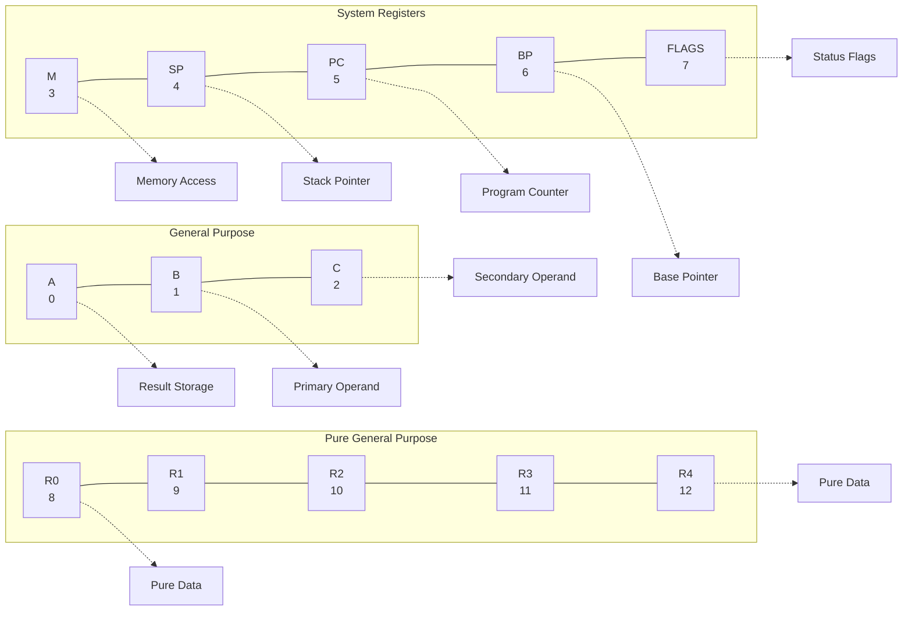
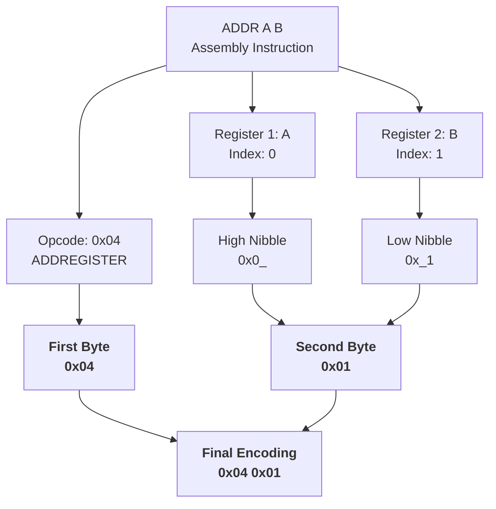
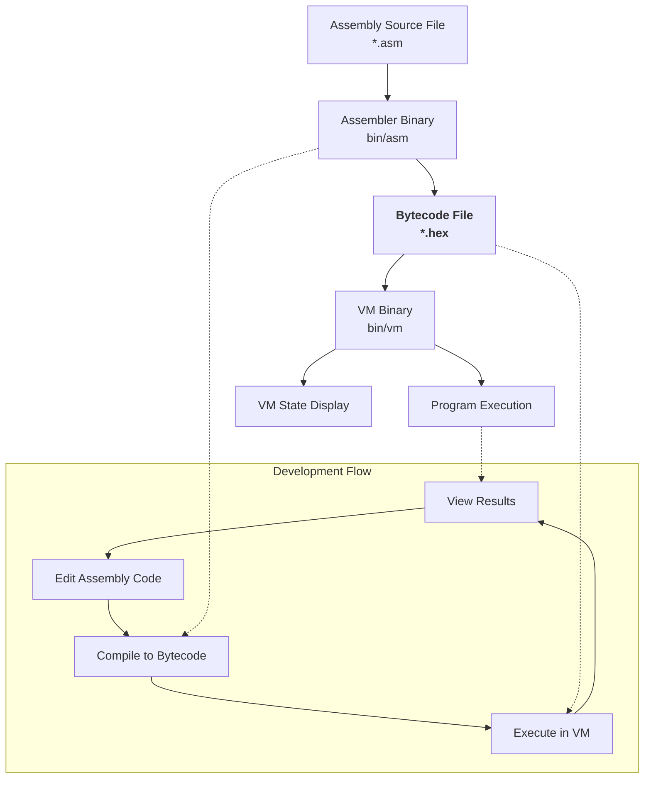
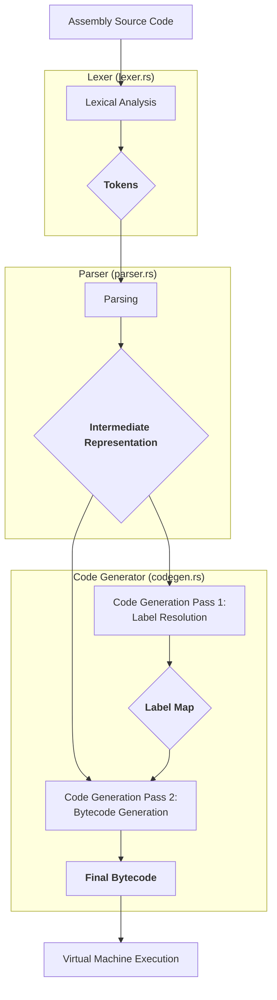
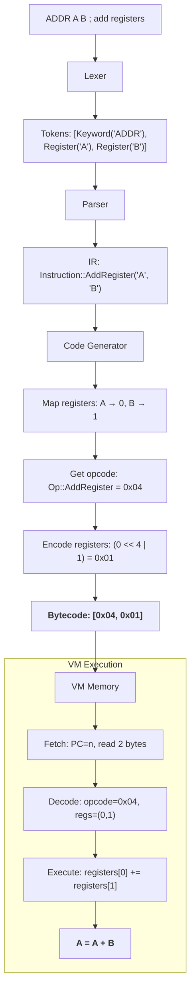

# Rusty 16-bit VM

A simple 16-bit virtual machine implementation in Rust. This project provides a stack-based VM with a small instruction set to execute basic programs.

## Architecture Overview

The Rusty 16-bit VM is a stack-based virtual machine designed with simplicity in mind. It executes instructions sequentially, using a stack for data operations and registers for state management. Recent updates have expanded its capabilities with register-to-register operations and enhanced assembler support.

The VM is designed with the following components:

### Memory

- 8 KB (8192 bytes) of linear memory
- Each memory location stores a single byte (8 bits)
- Memory addresses range from `0x0000` to `0x1FFF`

### Registers

The VM includes 13 16-bit registers:

| Register | Index | Purpose                                |
| -------- | ----- | -------------------------------------- |
| A        | 0     | General purpose / Result storage       |
| B        | 1     | General purpose / Operand              |
| C        | 2     | General purpose / Operand              |
| M        | 3     | Memory operations register             |
| SP       | 4     | Stack Pointer - points to next free slot|
| PC       | 5     | Program Counter - points to next instruction |
| BP       | 6     | Base Pointer - for stack frames        |
| FLAGS    | 7     | Status flags / Control register        |
| R0       | 8     | Pure general purpose (data only)       |
| R1       | 9     | Pure general purpose (data only)       |
| R2       | 10    | Pure general purpose (data only)       |
| R3       | 11    | Pure general purpose (data only)       |
| R4       | 12    | Pure general purpose (data only)       |


#### Register Usage

The 13 registers serve different purposes in the VM architecture:

1. **Dual-Purpose Registers (A, B, C)**: These can be used for general storage but are also used as implicit operands by some instructions. For example, `ADDR A B` adds the value in register B to register A and stores the result in A. When writing VM programs, keep in mind that these registers may be implicitly modified by certain operations.

2. **System Registers (M, SP, PC, BP, FLAGS)**: These registers have dedicated functions for managing program execution, memory operations, and VM state. They should generally only be modified with care as they control the VM's execution environment.

3. **Pure General Purpose (R0-R4)**: These registers are exclusively for data storage and aren't implicitly used by any instructions. They're ideal when you need registers that won't be modified by side effects of other operations and provide additional storage beyond the A, B, C registers.

#### Register Architecture Diagram



### Stack

- The stack grows upward in memory (from lower to higher addresses)
- SP (Stack Pointer) points to the next available memory location
- Each stack entry is 16 bits (2 bytes) wide
- Stack operations:
    - Push: Write value at SP, then increment SP by 2
    - Pop: Decrement SP by 2, then read value at SP

Stack Visualization:

```
Memory Address    Content        Description
+-------------+  +---------+
| 0x1004      |  |         |    Next available position (current SP)
+-------------+  +---------+
| 0x1002      |  |  0x0012 |    Last pushed value (18)
+-------------+  +---------+
| 0x1000      |  |  0x000A |    Earlier pushed value (10)
+-------------+  +---------+
```

## Instruction Format

Each instruction occupies 2 consecutive bytes in memory:

```
+------------+------------+
| Byte 0     | Byte 1     |
+------------+------------+
| OPCODE     | ARGUMENT   |
+------------+------------+
```

For two-register operations, the argument byte is divided into two 4-bit parts:

```
+------------+---------------------------+
| Byte 0     | Byte 1                    |
+------------+-----------+---------------+
| OPCODE     | REGISTER1 | REGISTER2     |
+------------+-----------+---------------+
| 8 bits     | 4 bits    | 4 bits        |
+------------+-----------+---------------+
```

This 4-bit encoding allows addressing all 13 registers (indices 0-12) in register-to-register operations.

#### Register Encoding Visualization



Memory layout example showing instructions:

```
Memory:
+-------+-------+-------+-------+-------+-------+-------+-------+
| 0x00  | 0x01  | 0x02  | 0x03  | 0x04  | 0x05  | 0x06  | 0x07  |
+-------+-------+-------+-------+-------+-------+-------+-------+
| 0x01  | 0x0A  | 0x01  | 0x08  | 0x03  | 0x00  | 0x02  | 0x00  |
+-------+-------+-------+-------+-------+-------+-------+-------+
  PUSH    10      PUSH    8     ADDSTACK  --    POPREG   REG_A
   |___________|    |___________|  |___________|  |___________|
   Instruction 1    Instruction 2  Instruction 3  Instruction 4
```

- **OPCODE** (1 byte): Specifies the operation to perform
- **ARGUMENT** (1 byte): Parameter for the operation

## Instruction Set

| Opcode | Mnemonic    | Assembly     | Argument          | Description                                | Compatible Registers |
| ------ | ----------- | ------------ | ----------------- | ------------------------------------------ | -------------------- |
| 0x00   | NOP         | `NOP`        | (none)            | No operation                               | -                    |
| 0x01   | PUSH        | `PUSH #n/$n` | 8-bit value       | Push value onto stack                      | -                    |
| 0x02   | POPREGISTER | `POP reg`    | Register index    | Pop value from stack into register         | A-FLAGS, R0-R4       |
| 0x03   | PUSHREGISTER| `PUSHR reg`  | Register index    | Push register value onto stack             | A-FLAGS, R0-R4       |
| 0x0F   | ADDSTACK    | `ADDS`       | (none)            | Pop two values, add them, push result      | -                    |
| 0x04   | ADDREGISTER | `ADDR r1 r2` | Two 4-bit indices | Add two registers, store in first register | A-FLAGS, R0-R4       |
| 0x09   | SIGNAL      | `SIG $n`     | 8-bit signal code | Signal the VM with a specific code         | -                    |

## Programming the VM

### Loading a Program

Programs are loaded directly into memory starting at address 0. Each instruction and its argument must be written to consecutive bytes.

Example using 8-bit memory operations (preferred method):

```rust
// Push 10 onto stack
vm.memory.write(0, 0x01);  // PUSH opcode
vm.memory.write(1, 10);    // Value 10

// Push 8 onto stack
vm.memory.write(2, 0x01);  // PUSH opcode
vm.memory.write(3, 8);     // Value 8

// Add the two values on stack
vm.memory.write(4, 0x03);  // ADDSTACK opcode
vm.memory.write(5, 0);     // Not used

// Pop result into register A
vm.memory.write(6, 0x02);  // POPREGISTER opcode
vm.memory.write(7, 0);     // Register A (index 0)
```

Alternative example using 16-bit memory operations:

```rust
// Each instruction is written as a single 16-bit value
// Format: opcode in lower 8 bits, argument in upper 8 bits

// Push 10 onto stack
vm.memory.write2(0, 0x0A01);  // 0x01 = PUSH, 0x0A = 10

// Push 8 onto stack
vm.memory.write2(2, 0x0801);  // 0x01 = PUSH, 0x08 = 8

// Add the two values on stack
vm.memory.write2(4, 0x0003);  // 0x03 = ADDSTACK, 0x00 = unused

// Pop result into register A
vm.memory.write2(6, 0x0002);  // 0x02 = POPREGISTER, 0x00 = Register A
```

Both approaches produce the same program in memory, but the 8-bit method is often easier to understand.

### Program Execution

1. PC starts at address 0
2. VM reads the opcode and argument at PC and PC+1
3. PC is incremented by 2 (to the next instruction)
4. The instruction is executed
5. Process repeats until program completion or error

## Program Examples

### Adding Two Numbers

This program adds two numbers (10 and 8) and stores the result in register A:

```
Address | Value | Description
--------|-------|------------
0x0000  | 0x01  | PUSH
0x0001  | 0x0A  | Value 10
0x0002  | 0x01  | PUSH
0x0003  | 0x08  | Value 8
0x0004  | 0x03  | ADDSTACK
0x0005  | 0x00  | (unused)
0x0006  | 0x02  | POPREGISTER
0x0007  | 0x00  | Register A
```

#### Execution Flow

Here's what happens when this program executes:

1. **Instruction 1: PUSH 10**

    ```
    PC = 0, SP = 0x1000
    Read opcode 0x01 (PUSH) and argument 0x0A (10)
    Action: Push 10 onto the stack
    Result: Memory[0x1000] = 10, SP = 0x1002, PC = 2
    ```

2. **Instruction 2: PUSH 8**

    ```
    PC = 2, SP = 0x1002
    Read opcode 0x01 (PUSH) and argument 0x08 (8)
    Action: Push 8 onto the stack
    Result: Memory[0x1002] = 8, SP = 0x1004, PC = 4
    ```

3. **Instruction 3: ADDSTACK**

    ```
    PC = 4, SP = 0x1004
    Read opcode 0x03 (ADDSTACK) and unused argument 0x00
    Action: Pop two values from stack, add them, push result
           Pop 8, then pop 10, compute 10 + 8 = 18, push 18
    Result: Memory[0x1002] = 18, SP = 0x1004, PC = 6
    ```

4. **Instruction 4: POPREGISTER A**
    ```
    PC = 6, SP = 0x1004
    Read opcode 0x02 (POPREGISTER) and argument 0x00 (Register A)
    Action: Pop value from stack, store in Register A
           Pop 18 and store in Register A
    Result: Register A = 18, SP = 0x1002, PC = 8
    ```

Final state: Register A contains 18

## Implementation Details

### Memory

Memory is implemented as a vector of bytes with bounds checking:

```rust
pub struct LinearMemory {
    bytes: Vec<u8>,
    size: usize,
}
```

The VM provides two ways to interact with memory:

1. **8-bit Operations**:
    - `read(addr)`: Read a single byte from memory
    - `write(addr, value)`: Write a single byte to memory

2. **16-bit Operations**:
    - `read2(addr)`: Read a 16-bit value from memory (2 consecutive bytes)
    - `write2(addr, value)`: Write a 16-bit value to memory

16-bit values are stored in memory using little-endian format:

```
Address N:   Lower 8 bits
Address N+1: Upper 8 bits
```

### Machine

The Machine struct ties everything together:

```rust
pub struct Machine {
    pub registers: [u16; 8],
    pub memory: Box<dyn Addressable>,
}
```

It provides methods for:

- Executing instructions: `step()`
- Stack manipulation: `push()` and `pop()`
- Register access: `get_register()`

## Building and Running

Clone the repository and use Cargo to build and run:

```bash
# Build the VM
cargo build

# Run the default example
cargo run
```

## Future Enhancements

Potential improvements for the VM:

- Additional instructions (subtraction, multiplication, division)
- Jump/branch instructions for control flow
- Memory-mapped I/O operations
- Assembler for easier program creation
- Support for functions and subroutines
- Extended memory addressing (beyond 8KB)
- Virtual I/O devices (terminal, disk, etc.)
- Interactive debugger with step-through execution

## Programming Techniques

### Using 8-bit vs 16-bit Operations

The VM supports both 8-bit and 16-bit memory operations:

**8-bit Operations (Recommended for Beginners)**:

```rust
// Writing a PUSH 10 instruction
vm.memory.write(0, 0x01);  // PUSH opcode at address 0
vm.memory.write(1, 10);    // Value 10 at address 1
```

**16-bit Operations (More Compact)**:

```rust
// Writing a PUSH 10 instruction (combining opcode and argument)
vm.memory.write2(0, 0x0A01);  // 0x01 = opcode, 0x0A = 10
```

In both cases, the resulting memory contains the same values:

- Memory[0] = 0x01 (PUSH opcode)
- Memory[1] = 0x0A (value 10)

### When to Use Each

- **8-bit Operations**: Better for understanding the VM's byte-by-byte operation
- **16-bit Operations**: More compact code when you're comfortable with the VM

## Debugging Tips

When writing programs for the VM:

1. **Track the Stack**: Monitor SP and the values on the stack after each operation
2. **Check Register Values**: Print register values at key points in your program
3. **Step Through Execution**: Execute one instruction at a time to identify issues
4. **Verify Memory Layout**: Ensure instructions are placed correctly in memory

Example debugging output:

```
Instruction: opcode=0x01, arg=0x0A @ PC=0 => Push(10)
SP: 0x1000
Instruction: opcode=0x01, arg=0x08 @ PC=2 => Push(8)
SP: 0x1002
Instruction: opcode=0x03, arg=0x00 @ PC=4 => AddStack
SP: 0x1004
AddStack: 10 + 8 = 18
Instruction: opcode=0x02, arg=0x00 @ PC=6 => PopRegister(A)
SP: 0x1002
Instruction: opcode=0x05, arg=0x09 @ PC=8 => Signal(9)
SP: 0x1000
```

## Assembly Language Support

The VM includes a basic assembler that can translate assembly language instructions into bytecode. The assembler supports the following syntax:

### Assembly Instructions

| Assembly    | Description                           | Example      | Registers      |
| ----------- | ------------------------------------- | ------------ | -------------- |
| `PUSH #n`   | Push decimal value n onto stack       | `PUSH #10`   | -              |
| `PUSH $n`   | Push hexadecimal value n onto stack   | `PUSH $0A`   | -              |
| `POP reg`   | Pop value from stack into register    | `POP A`      | A-H            |
| `PUSHR reg` | Push register value onto stack        | `PUSHR A`    | A-H            |
| `ADDS`      | Pop two values, add them, push result | `ADDS`       | -              |
| `ADDR r1 r2`| Add registers, store in first register| `ADDR A B`   | A-H (typically A-C) |
| `NOP`       | No operation                          | `NOP`        | -              |
| `SIG $n`    | Signal the VM with hex code n         | `SIG $09`    | -              |

### Assembly Example

```
PUSH #10    ; Push decimal 10 onto the stack
PUSH #24    ; Push decimal 24 onto the stack
ADDS        ; Add the two values (10+24=34)
POP B       ; Store result (34) in register B
PUSH #5     ; Push decimal 5 onto the stack
PUSH #22    ; Push decimal 22 onto the stack
ADDS        ; Add the two values (5+22=27)
POP C       ; Store result (27) in register C
PUSH #10    ; Push decimal 10 onto the stack
POP A       ; Store value (10) in register A
PUSH #20    ; Push decimal 20 onto the stack
POP B       ; Store value (20) in register B
ADDR A B    ; Add registers: A = A + B (10 + 20 = 30)
PUSHR A     ; Push register A value (30) onto stack
POP B       ; Store value (30) in register B
SIG $09     ; Signal to halt the VM
```

### Using the Assembler

```bash
# Compile assembly file to hexadecimal bytecode
cargo run --bin asm -- prog/your_program_asm > output.hex

# Run the VM with your program
cargo run --bin vm -- output.hex
```

### Makefile Commands

For convenience, you can use the provided Makefile:

```bash
# Generate binary from an assembly file
make gen-hex

# Run the VM with the generated binary
make run
```

## System Architecture

The Rusty 16-bit VM project consists of two main components: the assembler and the virtual machine. The following diagram illustrates how these components interact:



## Assembler Implementation

### Compiler Workflow

The following diagram illustrates the entire compilation process from assembly code to bytecode:



### Instruction Processing Example

The following diagram shows how a single instruction (`ADDR A B`) flows through the compilation pipeline:



The assembler is structured as a multi-stage compilation pipeline that converts assembly code into bytecode for the VM. This approach provides clear separation of concerns and makes the assembler extensible for future enhancements.

### Compilation Pipeline

The assembler processes assembly code in the following stages:

1. **Lexical Analysis** - Converts source text into tokens
2. **Parsing** - Transforms tokens into an intermediate representation (IR)
3. **Code Generation** - Converts IR into final bytecode

### Stage 1: Lexical Analysis

The lexer (`lexer.rs`) reads the assembly file line by line, handling:

- Comments (lines starting with `;` or inline comments)
- Empty lines
- Instructions and their operands
- Labels
- Different numeric formats (decimal with `#` prefix, hex with `$` prefix)

Each line is converted into a series of tokens like:
- `Keyword` (instructions like PUSH, POP)
- `Register` (register names like A, B)
- `Immediate` (decimal values)
- `Hex` (hexadecimal values)
- `LabelDecl` (label declarations)

For example, the line `PUSH #10 ; push decimal 10` is tokenized as `[Keyword("PUSH"), Immediate(10)]`, with the comment removed.

### Stage 2: Parsing

The parser (`parser.rs`) converts tokens into an intermediate representation using the `Instruction` enum:

- `Nop` - No operation
- `PushImmediate` - Push decimal value
- `PushHex` - Push hexadecimal value
- `PushRegister` - Push register value
- `Pop` - Pop value into register
- `AddStack` - Add values from stack
- `AddRegister` - Add two registers
- `Signal` - Signal the VM
- `Label` - Define a program label
- `Jump` - Jump to a label

The intermediate representation decouples the assembly syntax from the final bytecode, making it easier to optimize or transform the code.

### Stage 3: Code Generation

The code generator (`codegen.rs`) performs a two-pass process:

1. **First pass**: Maps labels to their byte offsets in the final code
2. **Second pass**: Generates actual bytecode for each instruction

This approach enables support for forward references and jumps to labels defined later in the code.

### Example: Processing `add_asm`

Here's how the program from `prog/add_asm` flows through the pipeline:

1. **Source line**: `PUSH #10            ; push 10 onto the stack`
   - **Lexer**: Generates tokens `[Keyword("PUSH"), Immediate(10)]`
   - **Parser**: Creates `Instruction::PushImmediate(10)`
   - **Codegen**: Outputs bytes `[0x01, 0x0A]` (opcode=PUSH, arg=10)

2. **Source line**: `ADDR A B            ; add the values in A and B, result in A`
   - **Lexer**: Generates tokens `[Keyword("ADDR"), Register("A"), Register("B")]`
   - **Parser**: Creates `Instruction::AddRegister("A", "B")`
   - **Codegen**: Outputs bytes `[0x04, 0x01]` (opcode=ADDR, arg=0x01 combining register indices 0 and 1)

3. **Source line**: `SIG $09             ; signal to the monitor that the program is done`
   - **Lexer**: Generates tokens `[Keyword("SIG"), Hex(9)]`
   - **Parser**: Creates `Instruction::Signal(9)`
   - **Codegen**: Outputs bytes `[0x09, 0x09]` (opcode=SIGNAL, arg=9)

This multi-stage approach makes it easy to extend the assembler with new instructions and optimization passes in the future.

### Future Instruction Support

While the codebase includes support for labels and jump instructions in the parser and IR phases, the code generator currently has a placeholder (`todo!`) for jump implementation. This will be completed in a future update to enable control flow operations like:

```
loop_start:
  PUSH #1           ; push 1 onto stack
  ADDR A B          ; A = A + B
  PUSHR A           ; push A onto stack
  PUSH #100         ; push 100 onto stack
  CMP               ; compare values (future instruction)
  JLT loop_start    ; jump if less than (future instruction)
```

### Instruction Encoding

When converting assembly to bytecode, the assembler follows these encoding rules:

1. **Basic Instructions** (NOP, ADDSTACK):
   - First byte: Opcode
   - Second byte: 0 (unused)

2. **Value Instructions** (PUSH, SIGNAL):
   - First byte: Opcode
   - Second byte: Immediate value

3. **Register Instructions** (POP, PUSHR):
   - First byte: Opcode
   - Second byte: Register index (0-12)
   - Example: `POP A` becomes `[0x02, 0x00]` (0x02=POP, 0x00=Register A)

4. **Two-Register Instructions** (ADDR):
   - First byte: Opcode
   - Second byte: Combined register indices (first register in upper 4 bits, second in lower 4 bits)
   - Example: `ADDR A B` becomes `[0x04, 0x01]` (0x04=ADDR, 0x01=(reg0<<4)|reg1)
   - Supports all registers (0-12) since 4 bits can represent values 0-15

The encoding for two-register instructions is designed for efficient storage:
```
ADDR A B  →  [0x04, 0x01]
             └─┬─┘  └─┬─┘
               │      │
               │      └─ Register encoding: (A:0 << 4) | (B:1) = 0x01
               └─ ADDREGISTER opcode: 0x04

Binary representation:
0000    0100  0000           0001
 └─opcode─┘    └reg────┬────reg┘
                High 4      Low 4
                bits        bits
                0000 = A    0001 = B
```

## Recent Updates

The latest version of the Rusty 16-bit VM includes the following enhancements:

1. **Register-to-Register Operations**: Added the `ADDR` instruction that allows direct addition between registers without needing to use the stack
2. **Push Register**: Implemented the `PUSHR` instruction that pushes the value of a register onto the stack
3. **Extended Register Set**: Added five pure general-purpose registers (R0-R4) that aren't implicitly used by any instruction
4. **Full 13-Register Support**: All instructions can use any of the 13 registers (A-FLAGS and R0-R4)
5. **No Operation**: Added the `NOP` instruction for padding and timing purposes
6. **Enhanced Instruction Encoding**: Improved opcode mapping to better support future instruction set extensions
7. **Multi-Stage Assembler**: Implemented a sophisticated assembler with lexer, parser, and code generation phases
8. **Label Support**: Added support for program labels in assembly code (foundation for jumps and branches)
9. **Comment Handling**: Enhanced assembly syntax with full support for inline and full-line comments

These improvements make the VM more versatile and closer to real-world CPU architectures by providing both stack-based and register-based operation models.

## Future Development

While this marks the final planned update to the project, potential future enhancements could include:

- Implementing conditional jumps and branches (foundational support already in place)
- Completing the jump instruction implementation
- Adding memory access instructions
- Supporting more complex arithmetic operations
- Implementing a proper calling convention for subroutines
- Developing a higher-level language that compiles to the VM's assembly

## License

This project is open source and available under the [MIT License](LICENSE).
